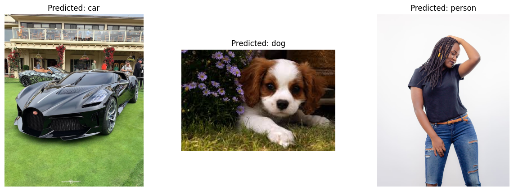

# CNN Multi-Class Classifier 🧠🔍

## 📋 Table of Contents
- [Project Overview](#project-overview)
- [Features](#features)
- [Project Structure](#project-structure)
- [Installation](#installation)
- [Usage](#usage)
- [Model Architecture](#model-architecture)
- [Training](#training)
- [Prediction](#prediction)
- [Performance](#performance)
- [Hardware Requirements](#hardware-requirements)
- [Contribution](#contributing)

## 🌟 Project Overview
This project implements a Convolutional Neural Network (CNN) for multi-class classification. The model is built from scratch, providing a deep understanding of the underlying architecture and training process. With an accuracy of around 90%, it demonstrates strong performance on the classification task.

## 🚀 Features
- Custom CNN model implementation
- Defined training loop
- Configurable loss function and optimizer
- Model training and accuracy evaluation
- Model saving functionality
- Separate prediction script for the saved model
- High accuracy (~90%)
- CPU-based training, no GPU required

## 📁 Project Structure
The project is organized into separate notebooks for better modularity:
- `model.ipynb`: Contains the CNN model architecture & it includes the training loop, loss function, and optimizer
- `predict.ipynb`: Handles predictions using the saved model

## 🛠️ Installation
```bash
git clone https://github.com/akhil-varsh/cnn-multi-class-classifier.git
cd cnn-multi-class-classifier
pip install -r requirements.txt
```

## 🖥️ Usage
To train the model:
1. Run `model.ipynb` to define the model architecture

To make custom predictions using the saved model:
    Run `predict.ipynb`

## 🏗️ Model Architecture
The CNN architecture is defined from scratch in `model.ipynb`. It includes:
- Convolutional layers
- Pooling layers
- Fully connected layers
- Activation functions

For detailed architecture, refer to the `model.ipynb` file.

## 🏋️ Training-
The training process is implemented in `model.ipynb` and includes:
- Custom training loop
- Loss function: CrossEntropyLoss ---> Epoch [1/40], Loss: 1.2354
                                       Epoch [40/40], Loss: 0.0000
- Optimizer: Adam
- Number of epochs: 40 

## 🔮 Prediction
The `predict.ipynb` notebook is provided for making predictions using the saved model. This notebook loads the trained model and can be used for inference on new data.


Here's an example of a prediction made by the model:



## 📈 Performance
The model achieves an accuracy of approximately 90% on the test dataset, demonstrating its effectiveness in multi-class classification tasks.

## 💻 Hardware Requirements
This project is designed to run on standard CPU hardware. No GPU is required for training or inference, making it accessible to a wide range of users without the need for specialized hardware.

## 🤝 Contribution
Contributions to improve the project are welcome. 

---

<p align="center">
  Made with ❤️ by the Akhil
</p>
